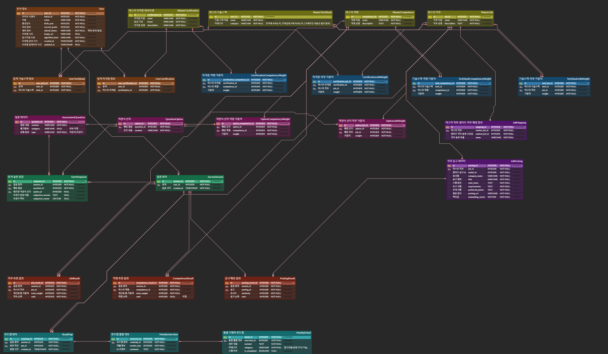

# DB 스키마

## 개요

* **날짜:** 2026.05.16
* **작성자:** 김석환

---

## 1. ERD 다이어그램

---

## 2. 테이블 명세서

### 1. 마스터 데이터셋

#### -1. MasterCertification

| 구분 | 컬럼명              | 설명        | 비고     |
|:---|:-----------------|:----------|:-------|
| PK | certification_id | 자격증 고유 ID | 자동 증가  |
|    | name             | 자격증 이름    | UNIQUE |
|    | issuer           | 자격증 발급 기관 |        |
|    | description      | 자격증 설명    |        |

#### -2. MasterTechStack

| 구분 | 컬럼명      | 설명                     | 비고     |
|:---|:---------|:-----------------------|:-------|
| PK | tech_id  | 기술스택 고유 ID             | 자동 증가  |
|    | name     | 기술스택 이름                | UNIQUE |
|    | category | 기술스택 카테고리(프레임워크/언어...) |        |

#### -3. MasterCompetency

| 구분 | 컬럼명           | 설명       | 비고     |
|:---|:--------------|:---------|:-------|
| PK | competency_id | 역량 고유 ID | 자동 증가  |
|    | name          | 역량 이름    | UNIQUE |
|    | description   | 역량 설명    |        |

#### -4. MasterJob

| 구분 | 컬럼명         | 설명          | 비고     |
|:---|:------------|:------------|:-------|
| PK | job_id      | 마스터직무 고유 ID | 자동 증가  |
|    | name        | 직무 이름       | UNIQUE |
|    | description | 직무 설명       |        |

---

### 2. 마스터 데이터셋 가중치 테이블

#### -1. TechStackCompetencyWeight

| 구분 | 컬럼명                | 설명        | 비고    |
|:---|:-------------------|:----------|:------|
| PK | tech_competency_id | 고유 ID     | 자동 증가 |
| FK | tech_id            | 기술스택 ID   |       |
| FK | competency_id      | 마스터 역량 ID |       |
|    | weight             | 부여 가중치    |       |

#### -2. TechStackJobWeight

| 구분 | 컬럼명         | 설명        | 비고    |
|:---|:------------|:----------|:------|
| PK | tech_job_id | 고유 ID     | 자동 증가 |
| FK | tech_id     | 기술스택 ID   |       |
| FK | job_id      | 마스터 직무 ID |       |
|    | weight      | 부여 가중치    |       |

#### -3. CertificationCompetencyWeight

| 구분 | 컬럼명                         | 설명        | 비고    |
|:---|:----------------------------|:----------|:------|
| PK | certification_competency_id | 고유 ID     | 자동 증가 |
| FK | certification_id            | 자격증 ID    |       |
| FK | competency_id               | 마스터 역량 ID |       |
|    | weight                      | 부여 가중치    |       |

#### -4. CertificationJobWeight

| 구분 | 컬럼명                  | 설명        | 비고    |
|:---|:---------------------|:----------|:------|
| PK | certification_job_id | 고유 ID     | 자동 증가 |
| FK | certification_id     | 자격증 ID    |       |
| FK | job_id               | 마스터 직무 ID |       |
|    | weight               | 부여 가중치    |       |

---

### 3. 유저 관련 테이블

#### -1. User

| 구분 | 컬럼명             | 설명           | 비고     |
|:---|:----------------|:-------------|:-------|
| PK | user_id         | 회원 고유 ID     | 자동 증가  |
|    | kakao_id        | 카카오 제공 ID    | UNIQUE |
|    | name            | 이름           |        |
|    | birth_year      | 출생연도         |        |
|    | current_grade   | 학년 정보        |        |
|    | attend_status   | 재학 정보 상태값    |        |
|    | image_url       | 프로필 사진 url   |        |
|    | algorithm_level | 알고리즘 레벨      |        |
|    | created_at      | 사용자 계정 생성 시각 | 디버깅용   |
|    | updated_at      | 프로필 업데이트 시각  | 디버깅용   |

#### -2. UserTechStack

| 구분 | 컬럼명          | 설명          | 비고    |
|:---|:-------------|:------------|:------|
| PK | user_tech_id | 고유 ID       | 자동 증가 |
| FK | user_id      | 유저 ID       |       |
| FK | tech_id      | 마스터 기술스택 ID |       |

#### -3. UserCertification

| 구분 | 컬럼명                   | 설명         | 비고    |
|:---|:----------------------|:-----------|:------|
| PK | user_certification_id | 고유 ID      | 자동 증가 |
| FK | user_id               | 유저 ID      |       |
| FK | certification_id      | 마스터 자격증 ID |       |

---

### 4. 공고 크롤링 관련 테이블

#### -1. JobMapping

| 구분 | 컬럼명           | 설명              | 비고     |
|:---|:--------------|:----------------|:-------|
| PK | mapping_id    | 고유 ID           | 자동 증가  |
| FK | master_job_id | 마스터직무 고유 ID     |        |
|    | wanted_job_id | 원티드 직군 분류 고유 ID | UNIQUE |
|    | name          | 세부 직무 이름        |        |

#### -2. JobPosting

| 구분 | 컬럼명              | 설명         | 비고     |
|:---|:-----------------|:-----------|:-------|
| PK | posting_id       | 고유 ID      | 자동 증가  |
|    | wanted_id        | 원티드내 공고 ID | UNIQUE |
| FK | job_id           | 마스터 직무 ID  |        |
|    | company_name     | 회사 이름      |        |
|    | title            | 공고 제목      |        |
|    | main_tasks       | 수행 업무      | 원본     |
|    | requirements     | 요구 사항      | 원본     |
|    | preferred_points | 우대 사항      | 원본     |
|    | embedding_vector | 벡터값        |        |
|    | posting_url      | 공고 원본 주소   |        |

---

### 5. 설문 문항 관련 테이블(데이터셋)

#### -1. AssessmentQuestion

| 구분 | 컬럼명         | 설명      | 비고       |
|:---|:------------|:--------|:---------|
| PK | question_id | 고유 ID   | 자동 증가    |
|    | content     | 질문 내용   |          |
|    | category    | 평가항목    | 확정 여부 미정 |
|    | type        | 주관식/객관식 |          |

#### -2. QuestionOption

| 구분 | 컬럼명         | 설명     | 비고    |
|:---|:------------|:-------|:------|
| PK | option_id   | 고유 ID  | 자동 증가 |
| FK | question_id | 질문 ID  |       |
|    | content     | 선택지 내용 |       |

#### -3. OptionCompetencyWeight

| 구분 | 컬럼명                  | 설명        | 비고    |
|:---|:---------------------|:----------|:------|
| PK | option_competency_id | 고유 ID     | 자동 증가 |
| FK | option_id            | 선택지 ID    |       |
| FK | competency_id        | 마스터 역량 ID |       |
|    | weight               | 부여 가중치    |       |

#### -4. OptionJobWeight

| 구분 | 컬럼명           | 설명        | 비고    |
|:---|:--------------|:----------|:------|
| PK | option_job_id | 고유 ID     | 자동 증가 |
| FK | option_id     | 선택지 ID    |       |
| FK | job_id        | 마스터 직무 ID |       |
|    | weight        | 부여 가중치    |       |

---

### 6. 사용자 응답 관련 테이블

#### -1. SurveySession

| 구분 | 컬럼명        | 설명       | 비고    |
|:---|:-----------|:---------|:------|
| PK | session_id | 고유 ID    | 자동 증가 |
| FK | user_id    | 설문 유저    |       |
|    | created_at | 설문 생성 시각 | 정렬용   |

#### -2. UserResponse

| 구분 | 컬럼명               | 설명        | 비고         |
|:---|:------------------|:----------|:-----------|
| PK | response_id       | 고유 ID     | 자동 증가      |
| FK | session_id        | 회차 ID     |            |
| FK | question_id       | 문항 정보 ID  | 주관식 추적을 위함 |
| FK | option_id         | 체크한 응답 ID | NULLABLE   |
|    | subjective_answer | 주관식 응답 내용 | NULLABLE   |
|    | subjective_vector | 주관식 벡터    | NULLABLE   |

#### -3. CompetencyResult

| 구분 | 컬럼명                  | 설명              | 비고       |
|:---|:---------------------|:----------------|:---------|
| PK | competency_result_id | 고유 ID           | 자동 증가    |
| FK | session_id           | 회차 ID           |          |
| FK | competency_id        | 마스터 역량 ID       |          |
|    | total_weight         | 해당 역량에 대한 총 가중치 |          |
|    | rank                 | 역량 순위           | 확정 여부 미정 |

#### -4. JobResult

| 구분 | 컬럼명           | 설명              | 비고    |
|:---|:--------------|:----------------|:------|
| PK | job_result_id | 고유 ID           | 자동 증가 |
| FK | session_id    | 회차 ID           |       |
| FK | job_id        | 마스터 직무 ID       |       |
|    | total_weight  | 해당 직무에 대한 총 가중치 |       |
|    | rank          | 직무 순위           |       |

#### -5. PostingResult

| 구분 | 컬럼명               | 설명        | 비고    |
|:---|:------------------|:----------|:------|
| PK | posting_result_id | 고유 ID     | 자동 증가 |
| FK | session_id        | 회차 ID     |       |
| FK | posting_id        | 공고 ID     |       |
|    | similarity        | 유사도 측정 결과 |       |
|    | rank              | 공고 순위     |       |

---

### 7. 로드맵 관련 테이블

#### -1. RoadMap

| 구분 | 컬럼명        | 설명    | 비고           |
|:---|:-----------|:------|:-------------|
| PK | roadmap_id | 고유 ID | 자동 증가        |
| FK | session_id | 회차 ID | UNIQUE       |
| FK | job_id     | 직무 ID | 목표 직무로 잡기 위함 |
|    | created_at | 생성 시각 |              |

#### -2. MonthlyOverview

| 구분 | 컬럼명         | 설명          | 비고             |
|:---|:------------|:------------|:---------------|
| PK | overview_id | 고유 ID       | 자동 증가          |
| FK | roadmap_id  | 로드맵 회차 ID   |                |
|    | month_num   | 개월 정보       |                |
|    | comment     | AI 코멘트(LLM) | 전체적으로 뭘 위한 달인지 |

#### -2. MonthlyDetail

| 구분 | 컬럼명          | 설명                  | 비고    |
|:---|:-------------|:--------------------|:------|
| PK | detail_id    | 고유 ID               | 자동 증가 |
| FK | overview_id  | 총괄 개월 ID            |       |
|    | content      | 세부 내용               |       |
|    | is_completed | 수행여부                |       |
|    | category     | 카테고리(알고리즘/관련 지식...) |       |